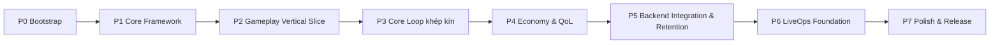

# Implementation Roadmap — Sổ tay vận hành & Blueprint thực thi

> **Đây là hợp đồng thực thi của toàn dự án.** Roadmap chia dự án thành **55 phase đánh số** (`01-*.md` … `55-*.md`), mỗi phase **một mục tiêu**, thực thi và verify độc lập, sắp theo **phụ thuộc kỹ thuật + nghiệp vụ**. Mỗi coding session (người hoặc AI) làm **đúng 1 phase**, không nhảy cóc, không đảo thứ tự. File này là **operating manual**; danh sách phase ở §11.

> **Nguyên tắc tối cao — "index, don't repeat":** roadmap chỉ chứa **chi tiết thực thi** (checklist, tiêu chí, cách kiểm tra, review). Mọi **luật/số liệu nghiệp vụ** (rate gacha, công thức kinh tế, chỉ số hero…) **luôn ở SSOT** (`../mvp/`, `../adr/`, `../gameplay/`) và được **link tới**, không chép lại. Nếu roadmap mâu thuẫn ADR/SSOT thì **roadmap sai** — sửa roadmap, không sửa SSOT.

---

## 1. Tổng quan dự án

Game mobile **2D Idle Squad RPG / Hero Collection** live-service dài hạn. **Client Godot 4.7 + GDScript** (`../../client/`) · **Backend .NET 9 Clean Architecture** (`../../server/`) · **Shared contracts + config-schema** (`../../shared/`) · **PostgreSQL + Redis**. Combat **full-auto, server-authoritative, deterministic-by-seed**. Tài liệu là SSOT; code viết để khớp docs. Tầm nhìn & MVP: [`../mvp/00-project-overview.md`](../mvp/00-project-overview.md), [`../mvp/01-mvp-definition.md`](../mvp/01-mvp-definition.md).

## 2. Triết lý roadmap

| Nguyên tắc | Diễn giải |
|---|---|
| Dependency-first | Nền (hợp đồng/config/DI/save) làm trước; feature xây trên nền đã chốt |
| Rủi ro cao làm sớm | Combat deterministic + authority (ADR-011) đưa lên sớm để lộ vấn đề |
| Loop-first | Dựng vòng lặp cốt lõi khép kín (đến phase 37) trước, đầy đủ/đẹp sau |
| Vertical slice | Từ phase 27 mỗi nhóm cho ra lát cắt **chơi được**, không phải module rời |
| Không rework | Không xây trên nền chưa chốt ADR; mỗi phase không đòi viết lại phase trước |
| Data-driven ngay từ đầu | Không hardcode balance; tránh refactor lớn khi thêm nội dung (ADR-004/005) |
| Cắt được | Should/Could dồn về cuối (nhóm 9+) để cắt an toàn theo MoSCoW khi trễ |
| Index, don't repeat | Roadmap link tới SSOT, không nhân bản tri thức nghiệp vụ |

## 3. Cách dùng roadmap

- **Lập trình viên:** mở phase kế tiếp chưa xong → đọc `# Mục tiêu`/`# Phạm vi`/`# Không thuộc phạm vi` → nạp context theo `# Liên kết` → làm tuần tự `# Công việc cần thực hiện` → đạt `# Tiêu chí hoàn thành` → chạy `# Cách kiểm tra` → điền `# Phase Review` mới đóng.
- **AI coding session:** mỗi phiên **chỉ đọc và thực thi 1 file phase**; không cần đọc lại toàn repo. File phase tự trỏ tới SSOT/ADR cần thiết. Tuân thủ `../ai/coding-rules.md` (§3 Forbidden Patterns) và `../ai/context-strategy.md`.
- **Người mới onboard:** đọc file này (§1–§4) → [`../mvp/00`](../mvp/00-project-overview.md) → [`../architecture/overview.md`](../architecture/overview.md) → phase 01 rồi đi theo số thứ tự.

## 4. Quy tắc thực thi & phụ thuộc

- **Đúng 1 phase/1 session.** Không gộp nhiều phase trừ khi phase ghi rõ.
- **Không nhảy/đảo thứ tự.** `# Phụ thuộc` của mỗi phase là bắt buộc; chỉ được bắt đầu khi mọi phase prerequisite đã **Đóng**.
- **Nền chốt bằng ADR.** Cần quyết định kiến trúc mới → đề xuất ADR (`../adr/README.md`), không tự quyết.
- **Ambiguity → không đoán.** Ghi vào [`../mvp/10-open-questions.md`](../mvp/10-open-questions.md) rồi hỏi.

## 5. Strict Phase Gate (quy tắc chuyển phase)

Một phase **chỉ được Đóng** khi đủ **tất cả**:

1. 100% `# Công việc cần thực hiện` hoàn tất.
2. 100% `# Tiêu chí hoàn thành` thoả (đo được).
3. Tài liệu ảnh hưởng đã cập nhật (doc-sync — §8).
4. Test đã viết & CI xanh (build/test/architecture/golden/config/smoke tuỳ phase).
5. Không vi phạm Forbidden Patterns (`../ai/coding-rules.md` §3).
6. Không còn TODO/FIXME/blocker/critical chưa xử lý.
7. `# Phase Review` kết luận "đủ điều kiện đóng".

**Chưa đủ ⇒ phase kế tiếp KHÔNG được bắt đầu.**

## 6. Definition of Ready (DoR)

Trước khi bắt đầu phase N: mọi phase trong `# Phụ thuộc` đã Đóng; ADR liên quan ở trạng thái **Accepted**; contract/schema mà phase cần đã tồn tại và review; câu hỏi 🔴 chặn (nếu có) đã có hướng trong `../mvp/10`.

## 7. Definition of Done (DoD) & Quality Gates

DoD canonical: [`../ai/review-and-dod.md`](../ai/review-and-dod.md) §4. Roadmap không định nghĩa lại — chỉ tham chiếu. **Quality Gates** (CI, tuỳ phase kích hoạt dần):

| Gate | Nội dung | Xuất hiện từ |
|---|---|---|
| Build | `dotnet build -c Release` (warnings-as-error) + Godot headless import | phase 01–03 |
| Unit/Integration test | `dotnet test` xanh; test đi kèm code | phase 02+ |
| Architecture test | NetArchTest: Domain không ref Infra; Application không ref Infra | phase 09+ |
| Config validate | `tools/config-validator` (JSON Schema + referential integrity) | phase 06–07 |
| Golden vector | Combat client≡server cùng seed→cùng output | phase 26+ |
| Smoke/Regression | Suite smoke các luồng cốt lõi | phase 54 |

## 8. Workflows liên kết

- **Coding:** [`../../.claude/workflows/implementation.md`](../../.claude/workflows/implementation.md)
- **Review:** [`../../.claude/workflows/review.md`](../../.claude/workflows/review.md) + checklist [`../ai/review-and-dod.md`](../ai/review-and-dod.md) §1
- **Documentation-sync (bắt buộc):** [`../../.claude/workflows/documentation-sync.md`](../../.claude/workflows/documentation-sync.md) — mọi thay đổi kiến trúc/deps/config-schema/contract/behavior phải cập nhật doc canonical **trong cùng change**.
- **Testing:** [`../testing/backend-testing.md`](../testing/backend-testing.md), [`../testing/godot-testing.md`](../testing/godot-testing.md)
- **Architecture (ADR mới):** [`../adr/README.md`](../adr/README.md)

## 9. Quy tắc bảo trì roadmap

- Roadmap tiến độ đổi → cập nhật file này + [`../audit/bootstrap-audit.md`](../audit/bootstrap-audit.md) + root [`../../ROADMAP.md`](../../ROADMAP.md) (theo ma trận doc-sync).
- Cần chèn phase mới: thêm file `NN-*.md`, cập nhật §11 + bảng §10; **không đổi số phase đã tồn tại** (giữ ổn định tham chiếu) — nếu chèn giữa, dùng hậu tố (vd `27a`) hoặc đánh số lại có chủ đích + sửa mọi cross-ref.
- Không bao giờ chép số liệu nghiệp vụ vào phase; luôn link SSOT.

## 10. Bảng ánh xạ Phase ↔ P0–P7 ↔ S0–S13 ↔ M0–M6 ↔ Feature

> Giữ tương thích với 3 góc nhìn gốc: giao hàng [`P0–P7`](#) (bảng §12), kỹ thuật [`../architecture/implementation-order.md`](../architecture/implementation-order.md) `S0–S13`, sản phẩm [`../mvp/11-development-roadmap.md`](../mvp/11-development-roadmap.md) `M0–M6`. Feature ID theo [`../mvp/04-feature-analysis.md`](../mvp/04-feature-analysis.md).

| Nhóm | Phase | P | S | M | Feature |
|---|---|---|---|---|---|
| 0 Nền tảng & Chuẩn hoá | 01–04 | P0 | S0 | M0 | hạ tầng |
| 1 Hợp đồng & Config | 05–08 | P1 | S1 | M0 | nền data-driven |
| 2 Backend Core Framework | 09–13 | P1 | S2 | M0 | F11 (nền) |
| 3 Client Core Framework | 14–17 | P1 | S3 | M0 | nền client |
| 4 Auth, Save & Config Service | 18–22 | P1 | S4–S5 | M0 | F11 |
| 5 Deterministic Combat Core | 23–26 | P2 | S6 | M1 | F04 (nền) |
| 6 Gameplay Vertical Slice | 27–30 | P2 | S7 | M1–M2 | F01,F03,F04 |
| 7 Collection Core | 31–33 | P3 | S8 | M2 | F02,F09,F10 |
| 8 Đóng vòng Core Loop | 34–37 | P3 | S9 | M3 | F05,F06,F07,F08 |
| 9 Kinh tế & QoL | 38–44 | P4 | S10–S11 | M4 | F14,F15,F18,F21,F22,F23 |
| 10 Retention & Tích hợp | 45–48 | P5 | S11 | M5 | F16,F17,F20,F13 |
| 11 LiveOps Foundation | 49–51 | P6 | S12 | M5 | F35(nền),F36 |
| 12 Polish & Release | 52–55 | P7 | S13 | M6 | F13,polish |

## 11. Mục lục 55 phase

**Nhóm 0 — Nền tảng & Chuẩn hoá**
- [01 — Cấu trúc repo & thực thi conventions](01-repo-structure-conventions.md)
- [02 — CI/CD server hardening](02-ci-cd-server.md)
- [03 — CI/CD client + validate-config + release](03-ci-cd-client-config-release.md)
- [04 — Môi trường dev & tooling](04-dev-environment-tooling.md)

**Nhóm 1 — Hợp đồng & Config Foundation**
- [05 — Shared Contracts skeleton](05-shared-contracts-skeleton.md)
- [06 — JSON Schema cho config](06-config-json-schema.md)
- [07 — Config Validator tool](07-config-validator-tool.md)
- [08 — Codegen pipeline](08-codegen-pipeline.md)

**Nhóm 2 — Backend Core Framework**
- [09 — Domain foundation](09-backend-domain-foundation.md)
- [10 — Application + MediatR pipeline behaviors](10-backend-application-mediatr.md)
- [11 — EF Core + PostgreSQL + migrations](11-backend-efcore-postgres.md)
- [12 — Redis cache + provider abstractions](12-backend-redis-cache.md)
- [13 — API layer (versioning/error/Swagger)](13-backend-api-layer.md)

**Nhóm 3 — Client Core Framework**
- [14 — Autoload EventBus + SceneRouter](14-client-eventbus-scenerouter.md)
- [15 — Autoload NetworkClient + models](15-client-networkclient.md)
- [16 — Autoload ConfigProvider + StateCache](16-client-configprovider-statecache.md)
- [17 — Boot flow + main scene + UI base](17-client-boot-ui-base.md)

**Nhóm 4 — Auth, Save & Configuration Service**
- [18 — Auth JWT guest (server)](18-auth-jwt-guest.md)
- [19 — Profile persistence & schema versioning](19-profile-persistence-versioning.md)
- [20 — Client integration auth + profile](20-client-auth-profile-integration.md)
- [21 — Configuration Service](21-configuration-service.md)
- [22 — Client config bundle end-to-end](22-client-config-bundle-e2e.md)

**Nhóm 5 — Deterministic Combat Core**
- [23 — Combat spec & fixed-point math](23-combat-spec-fixedpoint.md)
- [24 — Combat Sim server (.NET)](24-combat-sim-server.md)
- [25 — Combat Sim client (GDScript)](25-combat-sim-client.md)
- [26 — Golden vectors + cross-impl CI gate](26-combat-golden-vectors.md)

**Nhóm 6 — Gameplay Vertical Slice**
- [27 — Hero system (data-driven)](27-hero-system.md)
- [28 — Skill framework](28-skill-framework.md)
- [29 — Formation & Team-of-6](29-formation-team.md)
- [30 — Battle flow end-to-end](30-battle-flow-e2e.md)

**Nhóm 7 — Collection Core**
- [31 — Currencies + atomic transaction + idempotency](31-currencies-transactions.md)
- [32 — Inventory](32-inventory.md)
- [33 — Summon/Gacha](33-summon-gacha.md)

**Nhóm 8 — Đóng vòng Core Loop**
- [34 — Campaign PvE](34-campaign-pve.md)
- [35 — Hero upgrade (Level/EXP)](35-hero-upgrade-level.md)
- [36 — Energy (server-time)](36-energy-system.md)
- [37 — AFK/Idle rewards — chốt MVP loop](37-afk-idle-rewards.md)

**Nhóm 9 — Kinh tế & QoL**
- [38 — Equipment (basic gear)](38-equipment.md)
- [39 — Ascension / Star-up](39-ascension-star.md)
- [40 — Shop (static)](40-shop-static.md)
- [41 — Daily Quest](41-daily-quest.md)
- [42 — Mail system](42-mail-system.md)
- [43 — Sweep/Quick-battle + 2x](43-sweep-speed.md)
- [44 — Faction/Element advantage](44-faction-advantage.md)

**Nhóm 10 — Retention & Tích hợp**
- [45 — Ranking/Leaderboard](45-ranking-leaderboard.md)
- [46 — Tutorial/Onboarding](46-tutorial-onboarding.md)
- [47 — Daily login (minimal)](47-daily-login.md)
- [48 — Integration hardening client-server](48-integration-hardening.md)

**Nhóm 11 — LiveOps Foundation**
- [49 — Remote config nâng cao + feature flags](49-remote-config-flags.md)
- [50 — Mail broadcast + scheduling](50-mail-broadcast-scheduling.md)
- [51 — Telemetry/Analytics events](51-telemetry-analytics.md)

**Nhóm 12 — Polish & Release**
- [52 — Performance pass (mobile)](52-performance-pass.md)
- [53 — Security pass](53-security-pass.md)
- [54 — Regression/Smoke + golden coverage](54-regression-smoke.md)
- [55 — Release build & soft-launch prep](55-release-soft-launch.md)

## 12. Bảng phase tổng P0–P7 (giữ tương thích cross-ref)

| Phase | Prerequisites | Outputs | Acceptance | Playable? |
|---|---|---|---|---|
| **P0** Bootstrap | Blueprint duyệt | Repo layout, CI skeleton, conventions, Docker dev | CI xanh; dev env chạy | Chưa |
| **P1** Core Framework | P0 | Contracts+schema+validator; BE skeleton+DI; autoloads; Auth+Save; Config Service | Guest login+save; client nhận config versioned; architecture test xanh | Tối thiểu |
| **P2** Gameplay Vertical Slice | P1; ADR-011 | Deterministic combat (golden vector); Hero+Formation+Battle | Đánh 1 stage: server re-sim quyết kết quả, client replay khớp seed | ✅ |
| **P3** Core Loop khép kín | P2 | Summon/Gacha+Inventory+Currencies; Campaign+Progression+AFK+Energy | Loop khép kín; gacha rate/pity đúng; giao dịch atomic | ✅ **MVP loop** |
| **P4** Economy & QoL | P3 | Equipment, Ascension, Shop, Quest, Mail; sweep/2x, faction | Mỗi hệ test riêng; sweep dùng lại kết quả tất định | ✅ |
| **P5** Integration & Retention | P4 | Ranking, tutorial, daily login, hardening | Leaderboard cập nhật; onboarding hoàn tất; `../mvp/01` §2 đạt | ✅ |
| **P6** LiveOps Foundation | P5 | Remote config, feature flags, mail hàng loạt, telemetry | Bật/tắt qua flag; telemetry ghi nhận; publish config versioning/rollback | ✅ |
| **P7** Polish & Release | P6 | Balance, perf mobile, security, regression/smoke, build phát hành thử | Smoke xanh; ngưỡng perf đạt; security checklist; thiết bị thật | ✅ **soft launch** |

## 13. Common mistakes (tránh)

- Chép số liệu balance/rate vào phase file (phải link SSOT).
- Bắt đầu phase khi prerequisite chưa Đóng; hoặc gộp nhiều phase.
- Dùng `float` trong combat sim / global RNG / `DateTime.Now` trong logic (Forbidden Patterns).
- Client tự quyết kết quả/phần thưởng (vi phạm server-authoritative).
- Quên doc-sync khi đổi contract/schema/boundary ⇒ phase **không Done**.
- `switch/if` để mở rộng gameplay thay vì data/registry (ADR-004).

## 14. Best practices

- Đọc `# Liên kết` của phase trước khi code (nạp đúng SSOT/ADR/module doc).
- Bắt đầu **nhỏ, kèm test**; giữ PR nhỏ, mô tả WHY + link SSOT/ADR.
- Tôn trọng dependency rule (ADR-003) & để NetArchTest/architecture test gác cổng.
- Contract-first: chốt hợp đồng/schema (nhóm 1) trước khi hiện thực 2 phía.
- Rủi ro cao (combat determinism) làm sớm & phủ golden vector.

---

## Liên kết
- Thứ tự kỹ thuật module: [`../architecture/implementation-order.md`](../architecture/implementation-order.md)
- Roadmap sản phẩm: [`../mvp/11-development-roadmap.md`](../mvp/11-development-roadmap.md)
- Recommended sequence tổng: [`../README.md`](../README.md)
- Coding rules & Forbidden Patterns: [`../ai/coding-rules.md`](../ai/coding-rules.md)
- Definition of Done: [`../ai/review-and-dod.md`](../ai/review-and-dod.md)
- Trạng thái bootstrap hiện tại: [`../audit/bootstrap-audit.md`](../audit/bootstrap-audit.md)
