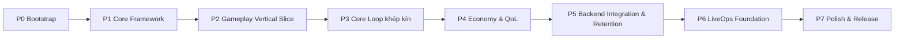

# Implementation Roadmap (Phase giao hàng)

> Chia toàn dự án thành **phase giao hàng**: mỗi phase có **prerequisites · expected outputs · acceptance criteria · playable?**. Đây là góc nhìn giao hàng; thứ tự kỹ thuật module ở `../architecture/implementation-order.md`; roadmap sản phẩm gốc ở `../mvp/11-development-roadmap.md`.

---

## 1. Chuỗi phase tổng

Ánh xạ: P0–P1 ≈ S0–S5, P2 ≈ S6–S7, P3 ≈ S8–S9, P4 ≈ S10–S11, P5 ≈ S4/S12 (tích hợp), P6 ≈ S12, P7 ≈ S13 (`../architecture/implementation-order.md`).

---

## 2. Chi tiết phase

### P0 — Project Bootstrap
| | |
|---|---|
| Prerequisites | Blueprint này được duyệt |
| Outputs | Repo layout, CI skeleton, conventions áp dụng, Docker compose dev |
| Acceptance | CI xanh (build client+server, 1 test mẫu mỗi phía); môi trường dev chạy |
| Playable? | Chưa (nền tảng) |

### P1 — Core Framework
| | |
|---|---|
| Prerequisites | P0 |
| Outputs | Contracts+config schema+validator; BE Clean Arch skeleton+DI; Client core autoloads; Auth+Save; Configuration Service |
| Acceptance | Guest login + lưu/đọc profile; client nhận config versioned; đổi config không rebuild client; architecture test xanh |
| Playable? | Tối thiểu (boot + kết nối) |

### P2 — Gameplay Vertical Slice
| | |
|---|---|
| Prerequisites | P1; ADR-011 (đã chốt) |
| Outputs | Deterministic combat sim (client+server, golden vector); Hero+Formation+Battle |
| Acceptance | Đánh 1 stage: server re-sim quyết kết quả, client replay khớp seed; golden vector xanh |
| Playable? | ✅ Có (đánh trận demo) |

### P3 — Core Loop khép kín (MVP Must)
| | |
|---|---|
| Prerequisites | P2 |
| Outputs | Summon/Gacha+Inventory+Currencies; Campaign+Progression(level)+AFK+Energy |
| Acceptance | Loop khép kín: summon→team→đánh→thưởng→nâng cấp→đẩy xa→AFK claim (server-side); gacha rate/pity đúng; giao dịch atomic |
| Playable? | ✅ **MVP loop chạy được** |

### P4 — Economy & QoL (MVP Should/Could)
| | |
|---|---|
| Prerequisites | P3 |
| Outputs | Equipment cơ bản, Ascension/sao, Shop tĩnh, Quest daily, Mail; sweep/2x, faction advantage (nếu vào) |
| Acceptance | Mỗi hệ test riêng; sweep dùng lại kết quả tất định; mail claim atomic |
| Playable? | ✅ Có (đầy đủ hơn) |

### P5 — Backend Integration & Retention
| | |
|---|---|
| Prerequisites | P4 |
| Outputs | Ranking đơn giản, tutorial hoàn chỉnh, daily login tối giản, hardening tích hợp client-server |
| Acceptance | Leaderboard cập nhật; người mới hoàn tất onboarding; tiêu chí `../mvp/01` §2 đạt |
| Playable? | ✅ Có (retention-ready) |

### P6 — LiveOps Foundation
| | |
|---|---|
| Prerequisites | P5 |
| Outputs | Remote config nâng cao, feature flags, mail hàng loạt, telemetry, schema event/banner/shop (chừa chỗ) |
| Acceptance | Bật/tắt feature qua flag; telemetry ghi nhận sự kiện core; publish config có versioning/rollback |
| Playable? | ✅ Có (vận hành được) |

### P7 — Polish & Release
| | |
|---|---|
| Prerequisites | P6 |
| Outputs | Balance pass, tối ưu perf mobile, security pass, regression/smoke đầy đủ, build phát hành thử |
| Acceptance | Smoke xanh; ngưỡng perf đạt; security checklist; chạy thiết bị thật; đo funnel/source-sink |
| Playable? | ✅ **MVP hoàn chỉnh cho soft launch** |

---

## 3. Nguyên tắc phase
- Mỗi phase **playable khi có thể** (từ P2 trở đi).
- Không phase nào đòi **rewrite** phase trước (nền chốt bằng ADR trước khi build).
- Cắt scope theo MoSCoW (`../mvp/01`) khi trễ: giữ Must (P0–P3), cắt Could→Should ở P4+.

## 4. Liên kết
- Thứ tự kỹ thuật module: `../architecture/implementation-order.md`
- Roadmap sản phẩm: `../mvp/11-development-roadmap.md`
- Recommended sequence tổng: `../README.md`
