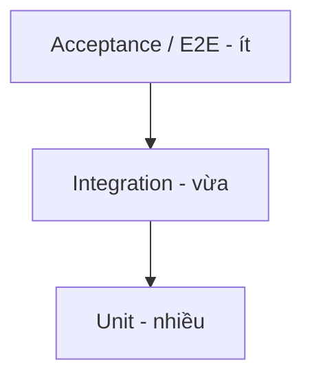

# Testing Strategy

> Chiến lược test tổng: pyramid, loại test, và CI validation. Chi tiết theo phía ở `backend-testing.md` và `godot-testing.md`. Ưu tiên test cho hệ **nhạy cảm** (combat determinism, kinh tế) — `../mvp/09`.

---

## 1. Test Pyramid

| Tầng | Tỉ trọng | Trọng tâm |
|---|---|---|
| Unit | Nhiều | Logic thuần: combat sim, fixed-point math, domain rule, handler |
| Integration | Vừa | Handler + DB/Redis (BE); feature + service (client) |
| Acceptance/E2E | Ít | Luồng core loop end-to-end |

## 2. Loại test & mục tiêu

| Loại | Mục tiêu | Nơi |
|---|---|---|
| Unit | Đúng logic đơn vị | BE + client |
| Integration | Đúng khi ghép hạ tầng | BE (DB/Redis), client (mock net) |
| **Golden vector (determinism)** | Combat client == server cho cùng seed | Cả 2 phía (ADR-011) |
| Regression | Không tái xuất bug cũ | Suite tích luỹ |
| Smoke | Build khởi động & luồng chính không vỡ | CI mỗi PR |
| Acceptance | Đáp ứng tiêu chí `../mvp/01` §2 | Theo milestone |
| Architecture test | Không vi phạm ranh giới tầng | BE (NetArchTest) |
| Config validation | Config đúng schema + id | CI (`tools/config-validator`) |

## 3. Ưu tiên test theo rủi ro (`../mvp/09`)

| Hệ thống | Vì sao ưu tiên |
|---|---|
| Combat sim (determinism) | Server re-sim/verify phụ thuộc (ADR-011) |
| Kinh tế/giao dịch (gacha/AFK/currency) | Atomic + idempotent, chống gian lận (ADR-007) |
| Save/migration | Mất dữ liệu = sống còn (`../mvp/09` BE2) |
| Config referential integrity | Config sai làm hỏng live |

## 4. CI Validation (gate merge)

| Bước CI | Bắt buộc |
|---|---|
| Build client + server | ✅ |
| Lint/format (gdlint, analyzers) | ✅ |
| Unit + integration | ✅ |
| Golden vector combat | ✅ |
| Architecture test (BE) | ✅ |
| Config validator | ✅ |
| Smoke (headless) | ✅ |

> PR không xanh **không merge** (`../conventions/git-conventions.md`, `../deployment/ci-cd-pipeline.md`).

## 5. Nguyên tắc
- Test tài liệu hoá ý định (đặc biệt golden vector = đặc tả combat sống).
- Áp dụng `test-driven-development` cho logic nhạy cảm; `edge-case-hunter` cho biên.
- Không test triển khai nội bộ dễ vỡ; test hành vi/hợp đồng.

## 6. Liên kết
- Backend: `backend-testing.md` · Client: `godot-testing.md`
- CI: `../deployment/ci-cd-pipeline.md` · Rủi ro: `../mvp/09`
